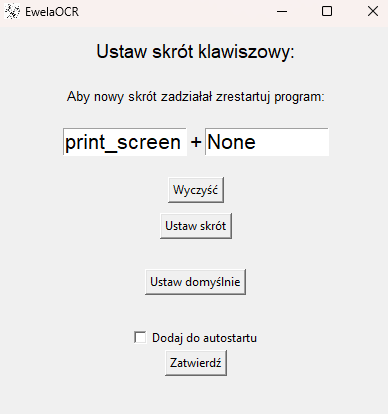
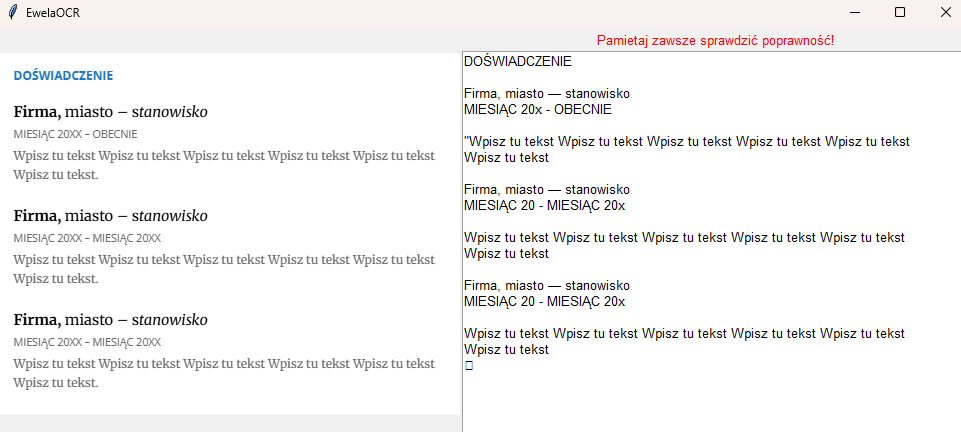
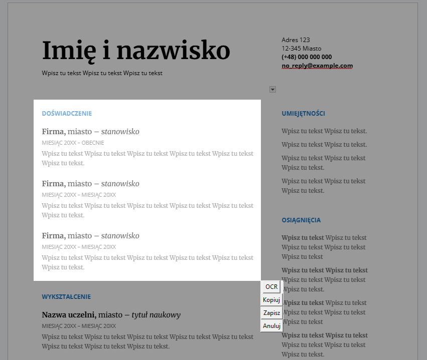

# 📸 EwelaOCR – OCR from screen in a click

**EwelaOCR** is a lightweight desktop application written in Python that allows you to take screenshots and extract text (OCR) from any selected screen area. It supports multi-monitor setups, runs in the background, integrates with the system tray, and provides features for copying, saving, and extracting text using **Tesseract** OCR engine.

---

## ✨ Features

- ⌨️ Customizable keyboard shortcut (e.g., `PrintScreen`)
- 📋 Fast OCR from selected screen region
- 💾 Save screenshot to a file
- 📋 Copy screenshot to clipboard
- 🖼️ Multi-monitor support
- ⚙️ Option to auto-start with Windows
- 🔧 Settings accessible from system tray

---

## 📦 Requirements

- Python 3.10+
- Windows OS
- [Tesseract OCR](https://github.com/tesseract-ocr/tesseract) installed and added to PATH

---

## ⚙️ Installation

1. Install Tesseract OCR and set its path in the `settings_file.py` file (`tesseract_path`).
2. Create and activate a virtual environment:

```bash
python -m venv venv
venv\Scripts\activate
```

3. Install dependencies:

```bash
pip install -r requirements.txt
```

4. Run the application:

```bash
python EwelaOCR.py
```

---

## 🖼️ Examples of Use

### 🧰 Application Settings

You can configure your own hotkey and enable auto-start with Windows.



---

### 🔍 OCR Result View

After performing OCR, the screenshot is displayed alongside the recognized text.



---

### 📋 Options Menu

After selecting an area, a small menu appears where you can:
- run OCR,
- copy the image to clipboard,
- save the screenshot,
- cancel the action.



---

## 🧪 Testing

The program runs in the background — you can launch it using the hotkey at any time. **Restart is required** after changing the shortcut key.

---

## 📄 License

Educational project. Free to use and modify for personal purposes.
